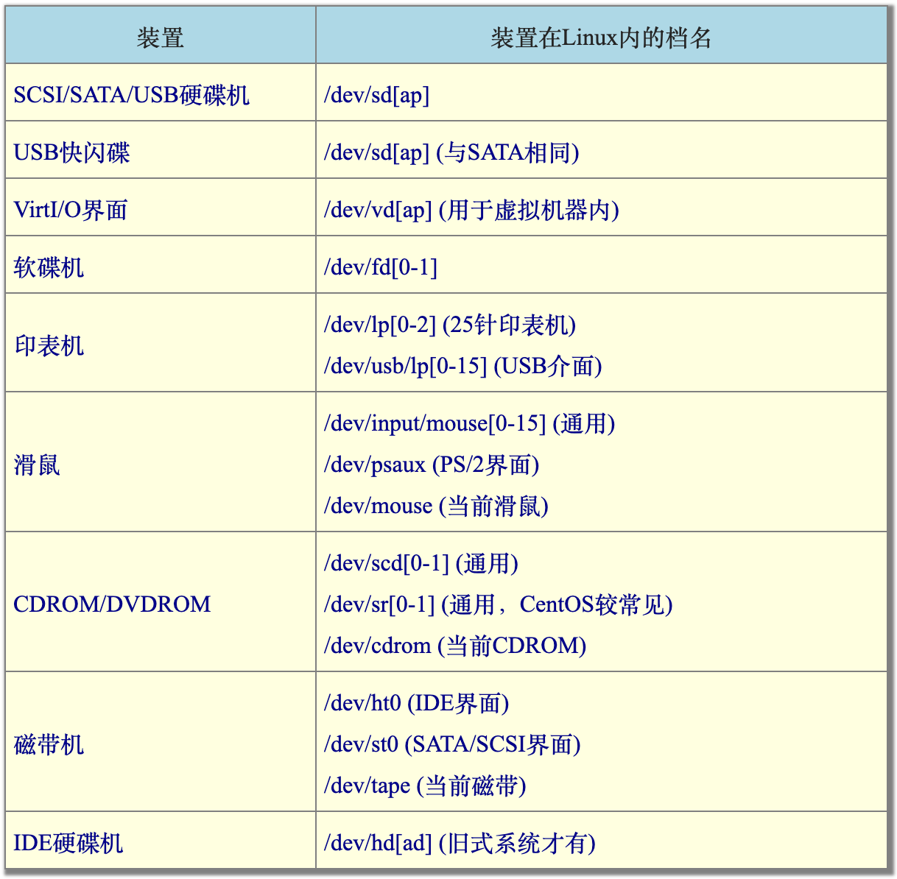
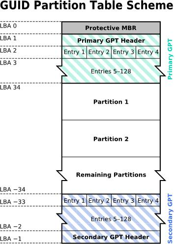
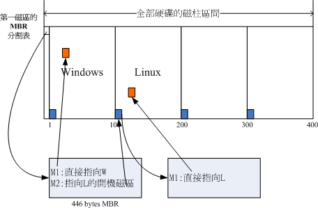

# 2. 主机规划与硬盘分割

## 2.1 Linux与硬件的搭配

- 各个元件或装置在Linux底下都是『一个档案！』 这个观念我们在第一章Linux是什么里面已经提过，这里我们再次的强调。

### 认识电脑的硬件配置

- 游戏机/工作机的考量
- 『效能/价格』比与『效能/消耗的瓦数』比的考量
- 兼容性考量

### 选择与Linux搭配的主机配置

- CPU
- RAM
- Hard Disk
- 显卡
- 网卡
- 光碟、软碟、键盘与滑鼠

### 各硬件装置在Linux中的文件名

SATA介面的硬碟的档案名称即为/dev/sd[ad]，其中，括号内的字母为ad当中的任意一个，亦即有/dev/sda, /dev/sdb, /dev/sdc,及/dev/sdd这四个档案的意思。

时至今日，由于IDE 界面的磁碟机几乎已经被淘汰，太少见了！因此现在连IDE 界面的磁碟档名也都被模拟成/dev/sd[ap] 了！

由于SATA/USB/SAS等磁碟介面都是**使用SCSI模组**来驱动的，因此这些介面的磁碟装置档名都是/dev/sd[ap]的格式。所以SATA/USB介面的磁碟根本就没有一定的顺序，那如何决定他的装置档名呢？这个时候就得要根据Linux核心侦测到磁碟的顺序了！

此外， 如果你的机器使用的是跟网际网路供应商(ISP) 申请使用的云端机器，这时可能会得到的是虚拟机器。为了加速，虚拟机器内的磁碟是使用模拟器产生， 该模拟器产生的磁碟档名为/dev/vd[ap] 系列的档名喔！要注意！要注意！

### 使用虚拟机

## 2.2 硬盘分割

### 硬盘连接的方式和装置文件名

- 硬盘的第一个扇区

  那么是否每个磁区都一样重要呢？其实整颗磁碟的第一个磁区特别的重要，因为他记录了整颗磁碟的重要资讯！

  早期磁碟第一个磁区里面含有的重要资讯我们称为MBR (Master Boot Record) 格式，但是由于近年来磁碟的容量不断扩大，造成读写上的一些困扰， 甚至有些大于2TB 以上的磁碟分割已经让某些作业系统无法存取。

  因此后来又多了一个新的磁碟分割格式，称为GPT (GUID partition table)！这两种分割格式与限制不太相同啦！

- 分区表

  那么分割表又是啥？其实你刚刚拿到的整颗硬碟就像一根原木，你必须要在这根原木上面切割出你想要的区段， 这个区段才能够再制作成为你想要的家具！如果没有进行切割，那么原木就不能被有效的使用。

  同样的道理，你必须要针对你的硬碟进行分割，这样硬碟才可以被你使用的！

### MBR与GPT分区表

#### 在文件系统（分区）的最小单位

- MBR

  通常磁碟可能有多个磁碟盘，所有磁碟盘的同一个磁轨我们称为**磁柱**(Cylinder)，通常那是档案系统的最小单位，也就是分割槽的最小单位啦！

- GPT

  为什么说『通常』呢？因为近来有GPT这个可达到64bit纪录功能的分割表，现在我们甚至可以使用**磁区**(sector)号码来作为分割单位哩！厉害了！

所以说，我们就是利用参考对照磁柱或磁区号码的方式来处理啦！

#### MBR：第一个分区（512B）放启动程序（446B）和分割表（64B）

早期的Linux 系统为了相容于Windows 的磁碟，因此使用的是支援Windows 的MBR(Master Boot Record) 的方式来处理**开机管理程式**与**分割表**！

而**开机管理程式纪录区**与**分割表**则通通放在磁碟的**第一个磁区**， 这个磁区通常是512bytes 的大小(旧的磁碟磁区都是512bytes 喔！)，所以说，第一个磁区512bytes 会有这两个资料：

- 主要开机记录区(Master Boot Record, MBR)

  可以安装开机管理程式的地方，有446 bytes。

- 分割表(partition table)

  记录整颗硬碟分割的状态，有64 bytes。

  由于分割表所在区块仅有64 bytes容量，因此最多仅能有**四组**记录区，每组记录区记录了该区段的启始与结束的磁柱号码。这四个分割的记录被称为**主要**(Primary)或**延伸**(Extended)分割槽。

  假设上面的硬碟装置档名为/dev/sda时，那么这四个分割槽在Linux系统中的装置档名如下所示， 重点在于档名后面会再接一个数字，这个数字与该分割槽所在的位置有关喔！

  - P1:/dev/sda1
  - P2:/dev/sda2
  - P3:/dev/sda3
  - P4:/dev/sda4

  ***

  - 延伸分割

    延伸分割的想法是： 既然第一个磁区所在的分割表只能记录四笔资料，那我可否利用额外的磁区来记录更多的分割资讯。

    我们可以透过延伸分割所指向的那个区块继续作分割的记录。

    延伸分割最多只能有一个(作业系统的限制)。

    如果延伸分割被破坏，所有逻辑分割将会被删除。 因为逻辑分割的资讯都记录在延伸分割里面嘛！

    

  - 逻辑分区

    如上图右下方那个区块有继续分割出五个分割槽，这五个由延伸分割继续切出来的分割槽，就被称为逻辑分割槽(logical partition)。

    同时注意一下，由于逻辑分割槽是由延伸分割继续分割出来的，所以他可以使用的磁柱范围就是延伸分割所设定的范围喔！也就是图中的101~400啦！

    同样的，上述的分割槽在Linux系统中的装置档名分别如下：

    - P1:/dev/sda1
    - P2:/dev/sda2
    - L1:/dev/sda5
    - L2:/dev/sda6
    - L3:/dev/sda7
    - L4:/dev/sda8
    - L5:/dev/sda9

    仔细看看，怎么装置档名没有/dev/sda3与/dev/sda4呢？因为前面**四个号码**都是保留给Primary或Extended用的嘛！所以逻辑分割槽的装置名称号码就由5号开始了！这在MBR方式的分割表中是个很重要的特性，不能忘记喔！

- 为什么要分割

  - 资料的安全性
  - 系统的效能考量

- 问题

  - 作业系统无法抓取到2.2T 以上的磁碟容量！
  - MBR 仅有一个区块，若被破坏后，经常无法或很难救援。
  - MBR 内的存放开机管理程式的区块仅446bytes，无法容纳较多的程式码。

#### GUID Partition Table

- Logical Block Address

  因为过去一个磁区大小就是512bytes 而已，不过目前已经有4K 的磁区设计出现！为了相容于所有的磁碟，因此在磁区的定义上面， 大多会使用所谓的**逻辑区块位址**(Logical Block Address, LBA)来处理。

  GPT 将磁碟所有区块以此LBA(预设为512bytes 喔！) 来规划，而第一个 LBA 称为LBA0 (从0 开始编号)。

- 34个512bytes记录分割咨询

  与MBR仅使用第一个512bytes区块来纪录不同， GPT使用了34个LBA区块来纪录分割资讯！同时与过去MBR仅有一的区块，被干掉就死光光的情况不同， GPT除了前面34个LBA之外，整个磁碟的最后33个LBA也拿来作为另一个备份！这样或许会比较安全些吧！详细的结构有点像底下的模样( [注1](http://linux.vbird.org/linux_basic/0130designlinux.php#ps1) )：

  

  - LBA0 (MBR 相容区块)

    与MBR模式相似的，这个相容区块也分为两个部份，一个就是跟之前446 bytes相似的区块，储存了第一阶段的开机管理程式！

    而在原本的分割表的纪录区内，这个相容模式仅放入一个特殊标志的分割，用来表示此磁碟为GPT格式之意。

    而不懂GPT分割表的磁碟管理程式，就不会认识这颗磁碟，除非用户有特别要求要处理这颗磁碟，否则该管理软体不能修改此分割资讯，进一步保护了此磁碟喔！

  - LBA1 (GPT 表头纪录)

    这个部份纪录了分割表本身的位置与大小，同时纪录了备份用的GPT 分割(就是前面谈到的在最后34 个LBA 区块) 放置的位置， 同时放置了分割表的检验机制码(CRC32 )，作业系统可以根据这个检验码来判断GPT 是否正确。

    若有错误，还可以透过这个纪录区来取得备份的GPT(磁碟最后的那个备份区块) 来恢复GPT 的正常运作！

  - LBA2-33 (实际纪录分割资讯处)

    从LBA2区块开始，每个LBA都可以纪录4笔分割纪录，所以在预设的情况下，总共可以有4*32 = 128笔分割纪录喔！因为每个LBA有512bytes，因此每笔纪录用到128 bytes的空间，除了每笔纪录所需要的识别码与相关的纪录之外，GPT在每笔纪录中分别提供了**64bits来记载开始/结束的磁区号码**，因此，GPT分割表对于单一分割槽来说，他的最大容量限制就会在『 2^64^ * 512bytes = 2^63^ * 1Kbytes = 2^33^ *TB = 8 ZB 』，要注意1ZB = 2^30^ TB啦！你说有没有够大了？

    此外，GPT 分割已经没有所谓的主、延伸、逻辑分割的概念，既然每笔纪录都可以独立存在， 当然每个都可以视为是主分割！每一个分割都可以拿来格式化使用喔！

    如果磁碟容量大于2TB 以上时，系统会自动使用GPT 分割方式来处理磁碟分割。

### BIOS和UEFI

并不是所有的作业系统都可以读取到GPT 的磁碟分割格式喔！同时，也不是所有的硬体都可以支援GPT 格式喔！

是否能够读写GPT 格式又与开机的检测程式有关！那开机的检测程式又分成啥鬼东西呢？就是BIOS 与UEFI 啦！

既然作业系统也是软体，那么我的电脑又是如何认识这个作业系统软体并且执行他的？明明开机时我的电脑还没有任何软体系统，那他要如何读取硬碟内的作业系统档案啊？

嘿嘿！这就得要牵涉到电脑的开机程序了！底下就让我们来谈一谈这个开机程序吧！

#### BIOS和CMOS

在计算机概论里面我们有谈到那个可爱的BIOS与CMOS两个东西。

#### CMOS

CMOS是记录各项硬体参数且嵌入在主机板上面的储存器；

#### BIOS

BIOS则是一个写入到主机板上的一个韧体(再次说明，韧体就是写入到硬体上的一个软体程式)。

1. 这个BIOS就是在开机的时候，电脑系统会主动执行的第一个程式了！

2. 接下来BIOS会去分析电脑里面有哪些储存设备，我们以硬碟为例，BIOS会依据使用者的设定去取得能够开机的硬碟，并且到该硬碟里面去读取**第一个磁区**的MBR位置。

   MBR这个仅有446 bytes的硬碟容量里面会放置最基本的开机管理程式，此时BIOS就功成圆满，而接下来就是MBR内的开机管理程式的工作了。

   如果你的分割表为GPT 格式的话，那么BIOS 也能够从LBA0 的MBR 相容区块读取第一阶段的开机管理程式码， 如果你的开机管理程式能够认识GPT 的话，那么使用BIOS 同样可以读取到正确的作业系统核心喔！

3. 这个开机管理程式(boot loader)的目的是在载入(load)核心档案。

   由于**开机管理程式是作业系统在安装的时候所提供**的，所以他会认识硬碟内的档案系统格式，因此就能够读取**核心档案**，然后接下来就是**核心档案**的工作，开机管理程式与BIOS也功成圆满，将之后的工作就交给大家所知道的作业系统啦！

- boot loader

  loader只会认识自己的系统槽内的可开机核心档案，以及其他loader而已；

  boot loader的主要任务有底下这些项目：

  - 提供选单

    使用者可以选择不同的开机项目，这也是多重开机的重要功能！

  - 载入核心档案

    直接指向可开机的程式区段来开始作业系统；

  - 转交其他loader

    将开机管理功能转交给其他loader负责。

    你的电脑系统里面可能具有两个以上的开机管理程式呢！有可能吗？我们的硬碟不是只有一个MBR而已？是没错啦！

    **但是开机管理程式除了可以安装在MBR之外，还可以安装在每个分割槽的开机磁区(boot sector)喔**！瞎密？分割槽还有各别的开机磁区喔？没错啊！这个特色才能造就『多重开机』的功能啊！

    我们举一个例子来说，假设你的个人电脑只有一个硬碟，里面切成四个分割槽，其中第一、二分割槽分别安装了Windows及Linux， 你要如何在开机的时候选择用Windows还是Linux开机呢？假设MBR内安装的是可同时认识Windows/Linux作业系统的开机管理程式， 那么整个流程可以图示如下：

    

    在上图中我们可以发现，MBR的开机管理程式提供两个选单，选单一(M1)可以直接载入Windows的核心档案来开机； 选单二(M2)则是将开机管理工作交给第二个分割槽的开机磁区(boot sector)。当使用者在开机的时候选择选单二时， 那么整个开机管理工作就会交给第二分割槽的开机管理程式了。当第二个开机管理程式启动后，该开机管理程式内(上图中)仅有一个开机选单，因此就能够使用Linux的核心档案来开机啰。这就是多重开机的工作情况啦！

#### UEFI

BIOS 其实不懂GPT 耶！还得要透过GPT 提供相容模式才能够读写这个磁碟装置。

而且BIOS 仅为16 位元的程式，在与现阶段新的作业系统接轨方面有点弱掉了！为了解决这个问题，因此就有了UEFI (Unified Extensible Firmware Interface) 这个统一可延伸韧体界面的产生。

UEFI 主要是想要取代BIOS 这个韧体界面，因此我们也称UEFI 为UEFI BIOS 就是了。UEFI 使用C 程式语言，比起使用组合语言的传统BIOS 要更容易开发！也因为使用C 语言来撰写，因此如果开发者够厉害，甚至可以在UEFI 开机阶段就让该系统了解TCP/IP 而直接上网！根本不需要进入作业系统耶！这让小型系统的开发充满各式各样的可能性！

某些作业系统要使用GPT 分割时，必须要搭配UEFI 的新型BIOS 格式才可安装使用。

另外，与BIOS模式相比，虽然UEFI可以直接取得GPT的分割表，不过最好依旧拥有BIOS boot的分割槽支援，同时，为了与windows相容，并且提供其他第三方厂商所使用的UEFI应用程式储存的空间，你必须要格式化一个vfat的档案系统，大约提供512MB到1G左右的容量，以让其他UEFI执行较为方便。

### Linux安装与分区

- 目录树

  我们现在知道整个Linux系统使用的是目录树架构，但是我们的档案资料其实是放置在磁碟分割槽当中的，现在的问题是『如何结合目录树的架构与磁碟内的资料』呢？这个时候就牵扯到『挂载(mount)』的问题啦！

- 挂载

  所谓的『挂载』就是利用一个目录当成进入点，将磁碟分割槽的资料放置在该目录下；也就是说，进入该目录就可以读取该分割槽的意思。

  这个动作我们称为『挂载』，那个进入点的目录我们称为『挂载点』。

  由于整个Linux系统最重要的是根目录，因此根目录一定需要挂载到某个分割槽的。

  至于其他的目录则可依使用者自己的需求来给予挂载到不同的分割槽。

  

- distributions安装时，挂载点与磁碟分割的规划

  - 初次接触Linux：只要分割『 / 』及『swap』即可

    通常初次安装Linux系统的朋友们，我们都会建议他直接以一个最大的分割槽『 / 』来安装系统。这样作有个好处，就是不怕**分割错误造成无法安装**的困境！

    例如/usr是Linux的可执行程式及相关的文件摆放的目录， 所以他的容量需求蛮大的，万一你分割了一块分割槽给/usr，但是却给的不够大，那么就伤脑筋了！因为会造成无法将资料完全写入的问题，就有可能会无法安装啦！

    因此如果你是初次安装的话， 那么可以仅分割成两个分割槽『 / 与Swap 』即可。

  - 建议分割的方法：预留一个备用的剩余磁碟容量！

    在想要学习Linux的朋友中，最麻烦的可能就是得要常常处理分割的问题，因为分割是系统管理员很重要的一个任务。

    但如果你将整个硬碟的容量都用光了，那么你要如何练习分割呢？

    所以鸟哥在后续的练习中也会这样做， 就是请你特别预留一块不分割的磁碟容量，作为后续练习时可以用来分割之用！

    此外，预留的分割槽也可以拿来做为备份之用。

  - 麻烦一点的方式

    上面的方法是不保险的分割方法(所以鸟哥常常说这是『懒人分割法』)！因为如果任何一个小细节坏掉(例如坏轨的产生)，你的根目录将可能整个的损毁～挽救方面较困难！

    较麻烦一点的分割方式就是先分析这部主机的未来用途，然后根据用途去分析需要较大容量的目录，以及读写较为频繁的目录，将这些重要的目录分别独立出来而不与根目录放在一起，那当这些读写较频繁的磁碟分割槽有问题时，至少不会影响到根目录的系统资料，那挽救方面就比较容易啊！在预设的CentOS环境中，底下的目录是比较符合容量大且(或)读写频繁的目录啰：

    - /boot
    - /
    - /home
    - /var
    - Swap

## 2.3 安装Linux前的规划

### 选择适当的distribution

### 主机的服务规划与硬体的关系

- NAT

  通常小型企业或者是学校单位大多仅会有一条对外的连线，然后全公司/学校内的电脑全部透过这条连线连到网际网路上。此时我们就得要使用IP分享器来让这一条对外连线分享给所有的公司内部员工使用。那么Linux能不能达到此一IP分享的功能呢？当然可以，就是透过NAT服务即可达成这项任务了！

- SAMBA

  我们可以使用Linux上面的SAMBA这个软体来达成加入Windows网芳的功能喔！SAMBA的效能不错， 也没有用户端连线数的限制，相当适合于一般学校环境的档案伺服器(file server)的角色呢！

- Mail

- Web

- DHCP

- FTP

### 主机硬盘的主要规划

资料的分类与资料安全性的考量。
