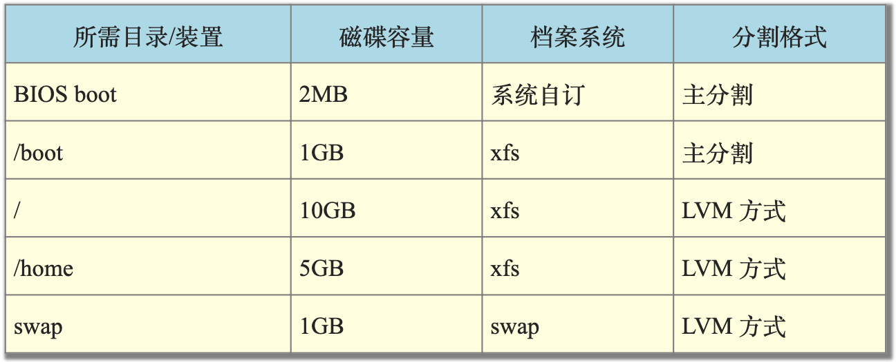

# 3. 安装CentOS

## 3.1 规划与分割参数

- Linux主机的角色定位

  本主机架设的主要目的在于练习Linux的相关技术，所以几乎所有的资料都想要安装进来。因此连较耗系统资源的X Window System也必须要包含进来才行。

- 选择的distribution

  CentOS

- 电脑系统硬件配置

  由于虚拟机器越来越流行，因此鸟哥这里使用的是Linux原生的KVM所搭建出来的虚拟硬体环境。

  对于Linux还不熟的朋友来说，建议你使用[2.4章](http://linux.vbird.org/linux_basic/0130designlinux.php#hardware_virtual)提到的virtualbox来进行练习吧！至于鸟哥使用的方式可以参考文末的延伸阅读，里面有许多的文件可参考( [注1](http://linux.vbird.org/linux_basic/0157installcentos7.php#ps1) )！

- 硬盘分割的配置

  在[第二章](http://linux.vbird.org/linux_basic/0130designlinux.php#largehd)里面有谈到MBR与GPT磁碟分割表配置的问题，在目前的Linux环境下，如果你的磁碟没有超过2TB的话，那么Linux预设是会以MBR模式来处理你的分割表的。

  由于我们仅切出40GB的磁碟来玩，所以预设上会以MBR来配置！这鸟哥不喜欢！因为就无法练习新的环境了～因此，我们得在安装的时候加上某些参数，强迫系统使用GPT的分割表来配置我们的磁碟喔！而预计实际分割的情况如下：

  

- boot loader

  练习机的开机管理程式使用CentOS 7.x预设的grub2软体，并且安装到MBR上面。

## 3.2 开始安装CentOS

另外，图中的『装置类型』其实共有3 种，我们的练习机实际使用标准分割与LVM 而已。那三种装置类型的意义分别如下：

- 标准分割区：就是我们一直谈的分割槽啊！类似/dev/vda1之类的分割就是了。
- LVM：这是一种可以弹性增加/削减档案系统容量的装置设定，我们会在后面的章节持续介绍LVM这个有趣的东西！
- LVM紧张供应：这个名词翻译的超奇怪的！其实这个是LVM的进阶版！与传统LVM直接分配固定的容量不同，这个『 LVM紧张供应』的项目，可以让你在使用多少容量才分配磁碟多少容量给你，所以如果LVM装置内的资料量较少，那么你的磁碟其实还可以作更多的资料储存！而不会被平白无故的占用！这部份我们也在后续谈到LVM的时候再来强调！

***

另外，图中的档案系统就是实际『格式化』的时候，我们可以格式化成什么档案系统的意思。底下分别谈谈各个档案系统项目(详细的项目会在后续章节说明)

- ext2/ext3/ext4：Linux早期适用的档案系统类型。由于ext3/ext4档案系统多了日志的记录，对于系统的复原比较快速。不过由于磁碟容量越来越大，ext家族似乎有点挡不住了～所以除非你有特殊的设定需求，否则近来比较少使用ext4项目了！

- swap：就是磁碟模拟成为记忆体，由于swap并不会使用到目录树的挂载，所以用swap就不需要指定挂载点喔。

  swap记忆体置换空间的功能是：当有资料被存放在实体记忆体里面，但是这些资料又不是常被CPU所取用时， 那么这些不常被使用的程序将会被丢到硬碟的swap置换空间当中， 而将速度较快的实体记忆体空间释放出来给真正需要的程序使用！所以，如果你的系统不很忙，而记忆体又很大，自然不需要swap啰。

- BIOS Boot：就是GPT分割表可能会使用到的项目，若你使用MBR分割，那就不需要这个项目了！

- xfs：这个是目前CentOS预设的档案系统，最早是由大型伺服器所开发出来的！他对于大容量的磁碟管理非常好，而且格式化的时候速度相当快，很适合当今动不动就是好几个TB的磁碟的环境喔！因此我们主要用这玩意儿！

- vfat：同时被Linux与Windows所支援的档案系统类型。如果你的主机硬碟内同时存在Windows与Linux作业系统，为了资料的交换，确实可以建置一个vfat的档案系统喔！

***

先提醒你自己记一下，你刚刚上面所选择的项目，包括root 的密码等等，通通都会被纪录到/root/anaconda-ks.cfg 这个档案内喔！这个档案可以提醒与协助你未来想要重建一个一模一样的系统时，就可以参考该档案来制作啰！当然，你也可以google 一下，找kickstart 这个关键字，会得到很多协助喔！
