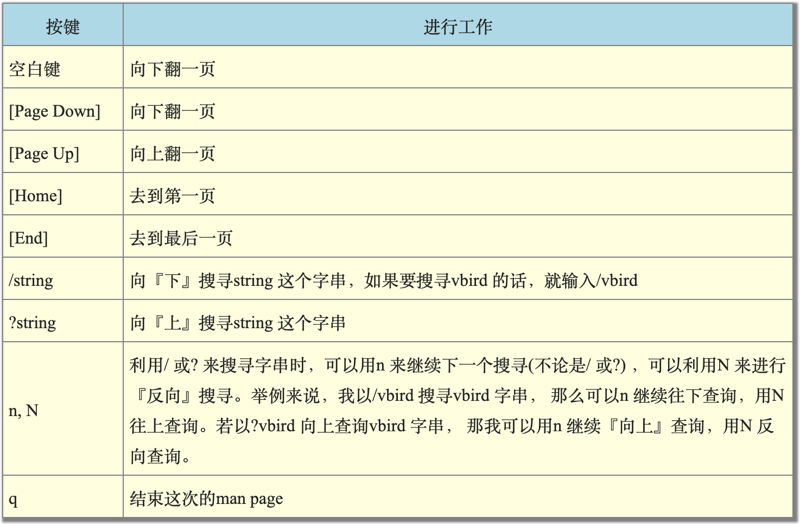

# 4. 首次登录与线上求助

## 4.1 首次登录系统

### X window与命令行模式的切换

- 在X的環境下想要『強制』重新啟動X的組合按鍵為：『[alt]+[ctrl]+[backspace]』；

- 6个终端

  通常我們也稱文字模式為終端機介面, terminal 或 console喔！Linux預設的情況下會提供六個Terminal來讓使用者登入， 切換的方式為使用：**[Ctrl] + [Alt] + [F1]~[F6]**的組合按鈕。

  那這六個終端介面如何命名呢，系統會將[F1] ~ [F6]命名為tty1 ~ tty6的操作介面環境。 也就是說，當你按下[ctrl] + [Alt] + [F1]這三個組合按鈕時 (按著[ctrl]與[Alt]不放，再按下[F1]功能鍵)， 就會進入到tty1的terminal介面中了。同樣的[F2]就是tty2囉！

  那麼如何回到剛剛的X視窗介面呢？很簡單啊！按下[Ctrl] + [Alt] + [F1]就可以了！我們整理一下登入的環境如下：

  - [Ctrl] + [Alt] + [F2] ~ [F6] ：文字介面登入 tty2 ~ tty6 終端機；
  - [Ctrl] + [Alt] + [F1] ：圖形介面桌面。

- 视窗环境

  其实，所谓的视窗环境，就是：『文字界面加上X 视窗软体』的组合！因此，文字界面是一定会存在的，只是视窗界面软体就看你要不要启动而已。所以，我们才有办法在纯文字环境下启动一个个人化的X 视窗啊！因为这个startx 是任何人都可以执行的喔！并不一定需要管理员身份的。

- 开始只有tty1

  在 CentOS 7 環境下，當開機完成之後，預設系統只會提供給你一個 tty 而已，因此無論是文字界面還是圖形界面，都是會出現在 tty1 喔！ tty2~tty6 其實一開始是不存在的！但是當你要切換時 (按下 [ctrl]+[alt]+[F2])，系統才產生出額外的 tty2, tty3...

- 预设

  由於系統預設的登入界面不同，因此你想要進入 X 的終端機名稱也可能會有些許差異。

  以 CentOS 7 為例，由於我們這次安裝的練習機， 預設是啟動圖形界面的，因此這個 X 視窗將會出現在 tty1 界面中。

  如果你的 Linux 預設使用純文字界面，那麼 tty1~tty6 就會被文字界面佔用。

  所以，是否预设要使用图形界面，只要在后续管理服务的程序中，将『 graphical.target 』这个目标服务设定为预设，就能够预设使用图形界面啰！

- CentOS 7 服务管理方式

  从这一版CentOS 7 开始，已经取消了使用多年的SystemV 的服务管理方式，也就是说，从这一版开始，已经没有所谓的『执行等级(run level) 』的概念了！新的管理方法使用的是systemd 的模式，这个模式将很多的服务进行相依性管理。以文字与图形界面为例，就是要不要加入图形软体的服务启动而已～ 对于熟悉之前CentOS 6.x 版本的老家伙们，要重新摸一摸systemd 这个方式喔！因为不再有/etc/inittab 啰！注意注意！

### 在终端界面登录linux

- 主机名称

  主机名称的显示通常只取第一个小数点前的字母，所以就成为study啦！

  至于login:则是一支可以让我们登入的程式。你可以在login:后面输入你的帐号。

- [dmtsai@study ~]\$ _

  这一行则是正确登入之后才显示的讯息，最左边的dmtsai显示的是『目前使用者的帐号』，而@之后接的study则是『主机名称』，至于最右边的~则指的是『目前所在的目录』，那个$则是我们常常讲的『提示字元』啦！

  - 提示字符

    在Linux当中，预设root的提示字元为# ，而一般身份使用者的提示字元为$ 。

- 登出系统

  `$ exit`

## 4.2 命令行下达指令

- shell

  其实我们都是透过『程式』在跟系统作沟通的，本章上面提到的视窗管理员或文字模式都是一组或一只程式在负责我们所想要完成的任务。

  文字模式登入后所取得的程式被称为壳(Shell)，这是因为这支程式负责最外面跟使用者(我们)沟通，所以才被戏称为壳程式！

### 下达指令

`$ command [-options] parameter1 parameter2 ... `

- 一行指令中第一个输入的部分绝对是『指令(command)』或『可执行档案(例如批次脚本,script)』

- 中刮号[]并不存在于实际的指令中，而加入选项设定时，通常选项前会带- 号，例如-h；有时候会使用选项的完整全名，则选项前带有-- 符号，例如--help；

  特殊情况下选项前面也会带加号，比如：

  ``` bash
  [dmtsai@study ~]$ date +%Y/%m/%d
  2015/05/29
  [dmtsai@study ~]$ date +%H:%M
  14:33
  ```

- 指令,选项,参数等这几个咚咚中间以空格来区分，**不论空几格shell都视为一格**。

- 指令太长的时候，可以使用反斜线(\) 来跳脱[Enter]符号，使指令连续到下一行。注意！反斜线后就立刻接特殊字符，才能跳脱！

- 区分大小写

### 常用指令

- `$ locale`

  显示系统语言，或者用`echo $LANG`。

  以利用export LANG=en_US.utf8 或者是export LC_ALL=en_US.utf8 等设定来修订语言显示乱码。

- `$ date`

  显示日期与时间

- `$ cal [month] [year]`

  显示日历

- `$ bc`

  简单好用的计算机。

  你在指令列输入bc后，萤幕会显示出版本资讯， 之后就进入到等待指示的阶段。

  bc预设仅输出整数，如果要输出小数点下位数，那么就必须要执行scale=number ，那个number就是小数点位数。

  离开bc回到命令提示字元时，务必要输入『quit』来离开bc的软体环境。

### 重要的快捷键

- Tab

  在各种Unix-Like的Shell当中， 这个[Tab]按键算是Linux的Bash shell最棒的功能之一了！

  他具有『命令补全』与『档案补齐』的功能喔！重点是，可以避免我们打错指令或档案名称呢！

  但是[Tab]按键在不同的地方输入，会有不一样的结果喔！

  - [Tab] 接在一串指令的第一个字的后面，则为『命令补全』；

    `$ ca[tab][tab] `

  - [Tab] 接在一串指令的第二个字以后时，则为『档案补齐』！

    `$ ls -al ~/.bash[tab][tab]`

  - 若安装bash-completion 软体，则在某些指令后面使用[tab] 按键时，可以进行『选项/参数的补齐』功能！

    `$ date --[tab][tab]`

    在这一版的CentOS 7.x 当中，由于多了一个名为bash_completion 的软体，这个软体会主动的去侦测『各个指令可以下达的选项与参数』等行为， 因此，那个『档案补齐』的功能可能会变成『选项、参数补齐』的功能，不一定会主动补齐档名了喔！这点得要特别留意。鸟哥第一次接触CentOS 7 的时候， 曾经为了无法补齐档名而觉得奇怪！烦恼了老半天说！

- Ctrl+C（中断）

  如果你在Linux底下输入了错误的指令或参数，有的时候这个指令或程式会在系统底下『跑不停』这个时候怎么办？

  别担心，如果你想让当前的程式『停掉』的话，可以输入：[Ctrl]与c按键( 先按着[Ctrl]不放，且再按下c按键，是组合按键 )，那就是**中断目前程式**的按键啦！

- Ctrl+D（输入结束或exit）

  这个组合按键通常代表着： 『键盘输入结束(End Of File, EOF或End Of Input)』的意思！

  另外，他也可以用来取代exit的输入呢！例如你想要直接离开文字介面，可以直接按下[Ctrl]-d就能够直接离开了(相当于输入exit啊！)。

- Shift+PageUp/PageDown

  如果你在纯文字的画面中执行某些指令，这个指令的输出讯息相当长啊！所以导致前面的部份已经不在目前的萤幕画面中， 所以你想要回头去瞧一瞧输出的讯息，那怎办？

  其实，你可以使用[Shift]+[Page Up] 来往前翻页，也能够使用[Shift]+[Page Down] 来往后翻页！

## 4.3 Linux系统中请求帮助

### 指令的`--help`选项

通常--help 用在协助你查询『你曾经用过的指令所具备的选项与参数』而已， 如果你要使用的是从来没有用过得指令，或者是你要查询的根本就不是指令，而是档案的『格式』时，那就得要透过man page 啰！！

### man page

- 指令对应的数字

  

- man page 结构

  

- man page 按键

  

- man page 位置

  不同的distribution通常可能有点差异性，不过，通常是放在/usr/share/man这个目录里头。/usr/local/man 里可能也有。

  然而，我们可以透过修改他的man page搜寻路径来改善这个目录的问题！修改/etc/man_db.conf (有的版本为man.conf或manpath.conf或man.config等)即可啰！

- man page 一些有用参数

  - `-f`

    可以获得更多的信息。

    ``` bash
    [dmtsai@study ~]$ man -f man
    man (1) - an interface to the on-line reference manuals
    man (1p) - display system documentation
    man (7) - macros to format man pages
    ```

  - 数字

    当有多个man page的指令一样时，如果只输入`man 指令`，则根据`/etc/man_db.conf`中记录的顺序搜索。哪个说明文件先被搜索到，就先被显示出来。一般来说，数字小的先被显示。

    我们可以在man后面手动加上数字来指定说明文件。

    ``` bash
    [dmtsai@study ~]$ man 1 man   <==这里是用man(1)的文件资料 
    [dmtsai@study ~]$ man 7 man   <==这里是用man(7)的文件资料
    ```

  - `-k`

    当使用『man -f 指令』时，man只会找资料中的左边那个指令(或档案)的完整名称，有一点不同都不行！但如果我想要找的是『关键字』（即在左边右边都出现）呢？

    ``` bash
    [dmtsai@study ~]$ man -k man 
    fallocate (2) - man ipulate file space
    zshall (1) - the Z shell meta- man page
     ....(中间省略).... 
    yum-config- man ager (1) - manage yum configuration options and yum repositories
    yum-groups- man ager (1) - create and edit yum's group metadata
    yum-utils (1) - tools for man ipulating repositories and extended package management
    ```

- 与`man`有关的指令

  事实上，还有两个指令与man page有关呢！而这两个指令是man的简略写法说～就是这两个：

  ```bash
  [dmtsai@study ~]$ whatis [指令或者是资料]    <==相当于man -f [指令或者是资料]  [dmtsai@study ~]$ apropos [指令或者是资料]    <==相当于man -k [指令或者是资料] 
  ```

  而要注意的是，这两个特殊指令要能使用，必须要有建立whatis 资料库才行！这个资料库的建立需要以 root 的身份下达如下的指令：

  ```bash
  [root@study ~]# mandb  
  #旧版的Linux这个指令是使用makewhatis喔！这一版开使用mandb了！
  ```

### info page

- man是共有的，info是独有的

  在所有的Unix Like系统当中，都可以利用man 来查询指令或者是相关档案的用法； 

  但是，在Linux里面则又额外提供了一种线上求助的方法，那就是利用info这个好用的家伙啦！

- info和man不同的地方

  基本上，info与man的用途其实差不多，都是用来查询指令的用法或者是档案的格式。

  但是与man page一口气输出一堆资讯不同的是，info page则是将文件资料拆成一个一个的段落，每个段落用自己的页面来撰写，并且在各个页面中还有类似网页的『超连结』来跳到各不同的页面中，每个独立的页面也被称为一个**节点**(node)。所以，你可以将info page想成是文字模式的网页显示资料啦！

- 支持info的说明文件存放位置

  不过你要查询的目标资料的说明文件必须要以info的格式来写成才能够使用info的特殊功能(例如超连结)。

  而这个支援info指令的文件预设是放置在/usr/share/info/这个目录当中的。

  至于非以info page格式写成的说明文件(就是man page)，虽然也能够使用info来显示，不过其结果就会跟man相同。举例来说，你可以下达『info man』就知道结果了！

### 其他说明文档

那么这些说明文件要摆在哪里呢？哈哈！就是摆在`/usr/share/doc`这个目录啦！

所以说，你只要到这个目录底下，就会发现好多好多的说明文件档啦！还不需要到网路上面找资料呢！

举例来说，你可能会先想要知道grub2这个新版的开机管理软体有什么能使用的指令？那可以到底下的目录瞧瞧：

`/usr/share/doc/grub2-tools-2.02`

另外，很多原版软体释出的时候，都会有一些安装须知、预计工作事项、未来工作规划等等的东西，还有包括可安装的程序等， 这些档案也都放置在/usr/share/doc 当中喔！

而且/usr/share/doc这个目录下的资料主要是以**套件(packages)**为主的， 例如nano 这个软体的相关资讯在/usr/share/doc/nano-xxx(那个xxx表示版本的意思！) 。

## 4.4 文本编辑器nano

- 打开文件

  `[dmtsai@study ~]$ nano text.txt `

  text.txt存在就开启旧档，不存在就开启新档。
  
- 关闭文件

  `Ctrl+X`

  `Y`

  如果是单纯的想要储存而已，直接按下[enter]即可储存后离开nano程式。

## 4.5 正确的关机方法

在Linux底下，由于每个程序(或者说是服务)都是在在背景下执行的，因此，在你看不到的萤幕背后其实可能有相当多人同时在你的主机上面工作，例如浏览网页啦、传送信件啦以FTP传送档案啦等等的，如果你直接按下电源开关来关机时，则其他人的资料可能就此中断！

此外，最大的问题是，若不正常关机，则可能造成档案系统的毁损 （因为来不及将资料回写到档案中，所以有些服务的档案会有问题！）。

所以正常情况下，要关机时需要注意底下几件事：

- 观察系统的使用状态

  如果要看目前有谁在线上，可以下达『who』这个指令；

  而如果要看网路的连线状态，可以下达『 netstat -a 』这个指令；

  而要看背景执行的程序可以执行『 ps -aux 』这个指令。

  使用这些指令可以让你稍微了解主机目前的使用状态！当然啰，就可以让你判断是否可以关机了（这些指令在后面Linux常用指令中会提及喔！）

- 通知线上使用者关机的时刻：
  要关机前总得给线上的使用者一些时间来结束他们的工作，所以，这个时候你可以使用shutdown的特别指令来达到此一功能。

- 正确的关机指令使用：
  例如shutdown与reboot两个指令！

  由于Linux系统的关机/重新开机是很重大的系统运作，因此只有root才能够进行例如shutdown, reboot等指令。

  不过在某些distributions当中，例如我们这里谈到的CentOS系统，他允许你在本机前的tty1~tty7当中(无论是文字界面或图形界面)， 可以用一般帐号来关机或重新开机！但某些distributions则在你要关机时，他会要你输入root的密码呢！^_^

### sync

万一你的系统因为某些特殊情况造成不正常关机(例如停电或者是不小心踢到power)时，由于资料尚未被写入硬碟当中，哇！所以就会造成资料的更新不正常啦！那要怎么办呢？这个时候就需要sync这个指令来进行资料的写入动作啦！

- sync保存内存中尚未被存盘的资料

  直接在文字介面下输入sync，那么在**记忆体中尚未被更新**的资料，就会被写入硬碟中！所以，这个指令在系统关机或重新开机之前， 很重要喔！最好多执行几次！

- 一般的关机指令已经调用了sync

  虽然目前的**shutdown/reboot/halt 等等指令均已经在关机前进行了sync 这个工具的呼叫**，不过，多做几次总是比较放心点～呵呵～

- sync可以被root调用也可以被一般用户调用

  ``` bash
  [dmtsai@study ~]$ su -    #这个指令在让你的身份变成root ！底下请输入root的密码！
  Password:   #就这里！请输入安装时你所设定的root密码！
  Last login: Mon Jun 1 16:10:12 CST 2015 on pts/0
  
  [root@study ~]# sync
  ```

  事实上sync也可以被一般帐号使用喔！只不过一般帐号使用者所更新的硬碟资料就仅有自己的资料，不像root可以更新整个系统中的资料了。

### shutdown

- 实体登录用什么身份都可以关机

  由于Linux的关机是那么重要的工作，因此除了你是在主机前面以实体终端机(tty1~tty7)来登入系统时，不论用什么身份都能够关机之外；

- 远程登录只有root才有权利关机

  若你是使用远端管理工具(如透过pietty使用ssh服务来从其他电脑登入主机)，那关机就只有root有权力而已喔！

- shutdown

  我们较常使用的是shutdown这个指令，而这个指令会通知系统内的各个程序 (processes)，并且将通知系统中的一些服务来关闭。

  shutdown可以达成如下的工作：

  - 可以自由选择关机模式：是要关机或重新开机均可；
  - 可以设定关机时间: 可以设定成现在立刻关机, 也可以设定某一个特定的时间才关机。
  - 可以自订关机讯息：在关机之前，可以将自己设定的讯息传送给线上user 。
  - 可以仅发出警告讯息：有时有可能你要进行一些测试，而不想让其他的使用者干扰，或者是明白的告诉使用者某段时间要注意一下！这个时候可以使用 shutdown 来吓一吓使用者，但却不是真的要关机啦！

### reboot, halt, poweroff

还有三个指令可以进行重新开机与关机的任务，那就是reboot, halt, poweroff。

其实这三个指令呼叫的函式库都差不多，所以当你使用『man reboot』时，会同时出现三个指令的用法给你看呢。

其实鸟哥通常都只有记poweroff与reboot这两个指令啦！一般鸟哥在重新开机时，都会下达如下的指令喔：

```bash
[root@study ~]# sync; sync; sync; reboot 
```

既然这些指令都能够关机或重新开机，那他有没有什么差异啊？

基本上，在预设的情况下， 这几个指令都会完成一样的工作！(全部的动作都是去呼叫**systemctl** 这个重要的管理命令！) 所以，你只要记得其中一个就好了！重点是，你自己习惯即可！

```bash
[root@study ~]# halt       #系统停止～萤幕可能会保留系统已经停止的讯息！ 
[root@study ~]# poweroff   #系统关机，所以没有提供额外的电力，萤幕空白！ 
```

更多halt与poweroff的选项功能，请务必使用man去查询一下喔！

### systemctl

要注意，上面谈到的halt, poweroff, reboot, shutdown 等等，其实都是呼叫这个systemctl 指令的喔！这个指令跟关机有关的语法如下：

```bash
[root@study ~]# systemctl [指令]  
[root@study ~]# systemctl reboot     #系统重新开机  
[root@study ~]# systemctl poweroff   #系统关机 
```

指令项目包括如下： 

- halt 进入系统停止的模式，萤幕可能会保留一些讯息，这与你的电源管理模式有关 
- poweroff 进入系统关机模式，直接关机没有提供电力喔！ 
- reboot 直接重新开机 
- suspend 进入休眠模式